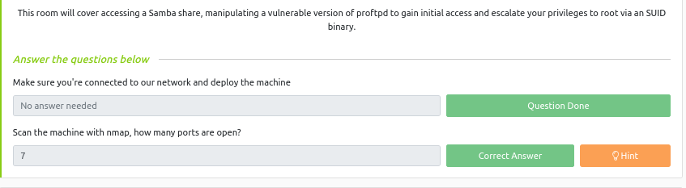
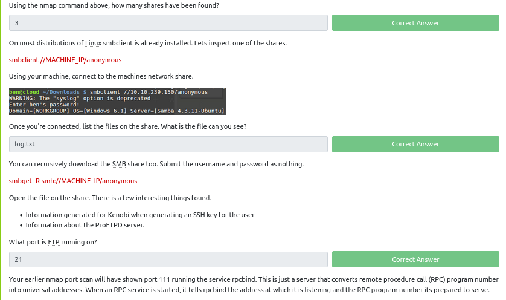
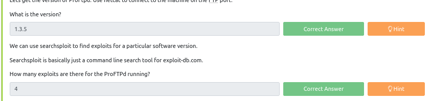
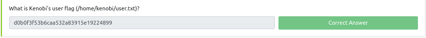
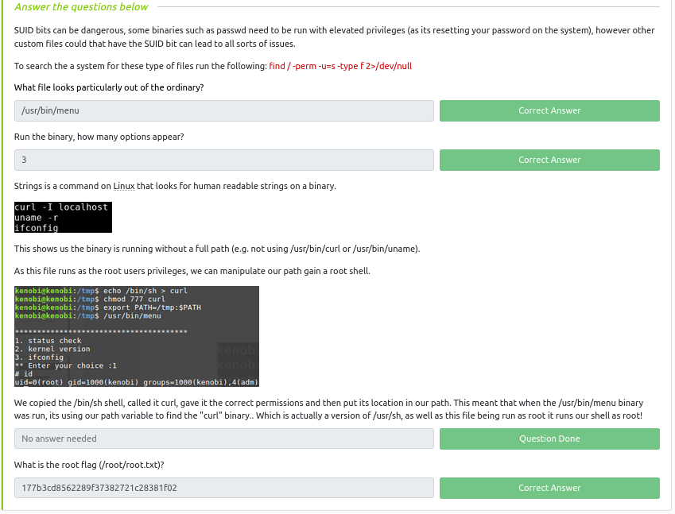

# TryHackMe free labs

## 1. Linux Fundamentals [done]

1. Linux Fundamentals Part 1

2. Linux Fundamentals Part 2

3. Linux Fundamentals Part 3

## 2. Web Fundamentals

1. HTTP in detail [ done ]
2. Burp Suite: The Basics [ done ]
3. OWASP Top 10 - 2021 
4. OWASP Juice Shop [ done ]
5. Pickle Rick [ done ]

## 3. Network Fundamentals, Attacks and Exploits

1. Introductory Networking

2. Nmap [ done ]

## 4. Basic Computer Exploitation

1. Metasploit

2. Vulnversity 

3. Basic Pentesting 

4. kenobi 

## 5. Defensive Blue Teaming

1. Nessus [ done ]
2. MITRE [ done ]
3. OpenVAS [ done ]
4. x86 Architecture Overview [ done ]
5. Dissecting PE Headers [ done ]
6. MalBuster [ done ]
7. Investigating Windows [ done ]
8. Windows Forensics 1 [ done ]
9. Redline [ done ]
10. Disk Analysis & Autopsy [ done ]
11. Intro to Threat Emulation [prob]
12. Thrat Modelling [ done ]