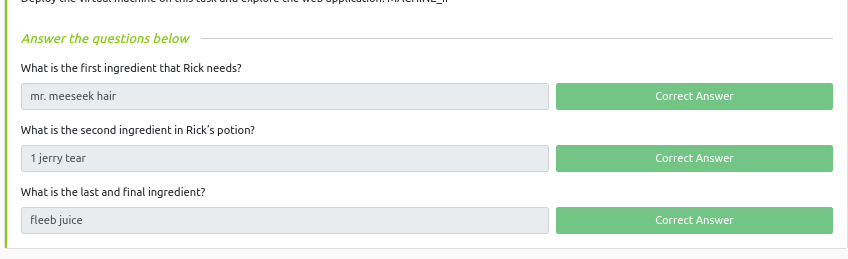

# TryHackMe free labs

## 1. Linux Fundamentals 

1. Linux Fundamentals Part 1

2. Linux Fundamentals Part 2

3. Linux Fundamentals Part 3

## 2. Web Fundamentals

1. HTTP in detail

2. Burp Suite: The Basics

3. OWASP Top 10 - 2021 

4. OWASP Top 10 

5. OWASP Juice Shop 

6. Pickle Rick

## 3. Network Fundamentals, Attacks and Exploits

1. Introductory Networking

2. Nmap [ done ]

## 4. Basic Computer Exploitation

1. Metasploit

2. Vulnversity 

3. Basic Pentesting 

4. kenobi 

## 5. Defensive Blue Teaming

1. Nessus

2. MITRE 

3. OpenVAS 

4. x86 Architecture Overview

5. Dissecting PE Headers 

6. MalBuster

7. Investigating Windows 

8. Windows Forensics 1 

9. Redline 

10. Disk Analysis & Autopsy 

11. Intro to Threat Emulation

12. Thrat Modelling

